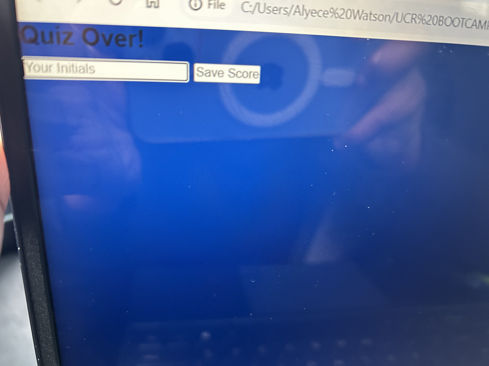

# quiz-java-1
Link to deployed application:

Link to the repository:
https://github.com/Watsonaj0316/quiz-java-1/blob/main/README.md

Features:
The user can take a timed quiz about javascript with a total of five questions.

General Info: The user will have 60 seconds to complete the quiz. If the user answers a question wrong time will be subtracted from the timer. When the user is finished with the quiz the user will then submit their initials to save their score.

Screenshot of the  following application:

 
